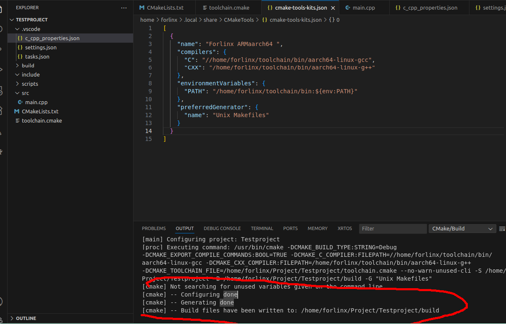
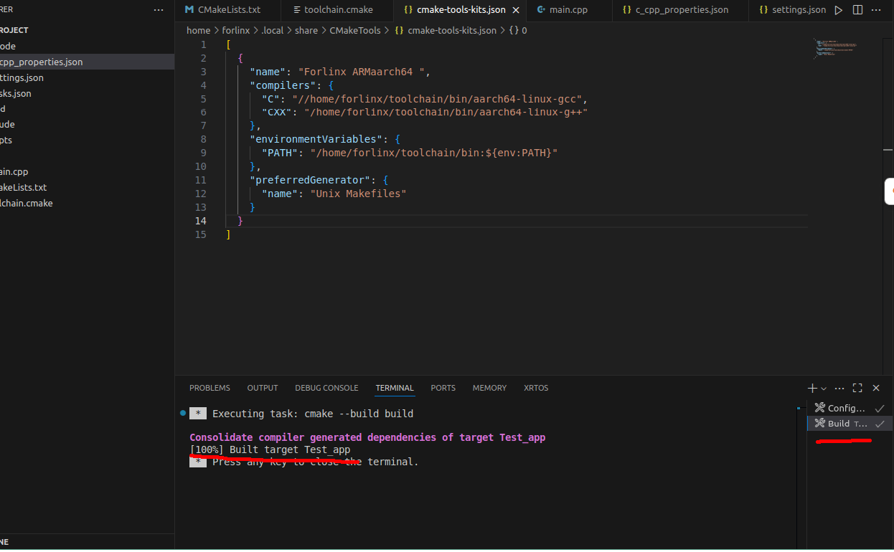

# 1. 环境搭建
## 1.1. 准备工作
准备好交叉编译工具链，将其拷贝到ubuntu虚拟中，然后添加其环境变量如
 ```
  echo 'export PATH=/home/forlinx/toolchain/bin:$PATH' >> ~/.bashrc 
  source ~/.bashrc  # 立即生效
 ```
## 1.2. 创建工程
递归创建文件夹
```
mkdir -p Testproject/{src,include,build,scripts}

```
按照此目录树创建加入文件
```
Testproject/
├── CMakeLists.txt          # CMake 主配置文件
├── toolchain.cmake
├── src/
│   └── main.cpp           # 示例代码
├── include/               # 头文件
├── build/                 # 构建目录
└── scripts/
    └── deploy.sh          # 部署脚本
└──.vscode/    
    └── c_cpp_properties.json          
    └── settings.json        
    └── tasks.json         

```
### 1.2.1. toolchain.cmake
toolchain.cmake 的作用:告诉 CMake “我现在要给 别的平台/架构 编译，请用 这套交叉编译器 和 这套头文件/库”。
toolchain.cmake的内容
```
set(CMAKE_SYSTEM_NAME Linux)
set(CMAKE_SYSTEM_PROCESSOR aarch64)   # 关键修正

set(CMAKE_C_COMPILER   /home/liudl/toolchain/bin/aarch64-linux-gcc)
set(CMAKE_CXX_COMPILER /home/liudl/toolchain/bin/aarch64-linux-g++)

set(CMAKE_SYSROOT /home/liudl/toolchain/aarch64-buildroot-linux-gnu/sysroot)

set(CMAKE_FIND_ROOT_PATH_MODE_PROGRAM NEVER)
set(CMAKE_FIND_ROOT_PATH_MODE_LIBRARY ONLY)
set(CMAKE_FIND_ROOT_PATH_MODE_INCLUDE ONLY)

```
上述CMAKE_C_COMPILER 、CMAKE_CXX_COMPILER、CMAKE_SYSROOT关于编译器的配置应该配置成当前环境交叉编译器的绝对位置。
### 1.2.2. CMakeLists.txt
 ** cmakelists.txt和makefile区别和关系**
  | 维度         | CMakeLists.txt                                                                           | Makefile                            |
| ----------   | ---------------------------------------------------------------- | ----------------------------------- |
| **定位**     | “**高层脚本**”——描述“项目需要哪些目标、源文件、依赖库”                                 | “**底层脚本**”——描述“**如何用命令把每个文件编译成目标**” |
| **面向谁**  | **面向开发者**（人类可读、跨平台）                                              | **面向 make 工具**（机器执行、平台相关）           |
| **语法复杂度**  | 相对简洁，自动推导依赖、递归扫描目录                                               | 需要手工写规则、变量、模式规则，易写错                 |
| **跨平台能力**  | **同一份 CMakeLists.txt 可生成**<br>Unix Makefile / Ninja / VS / Xcode | 一份 Makefile 通常只适用于 **一种平台**         |
| **实际产物**   | **不直接编译**；生成 **Makefile 或 Ninja、VS 工程等**                         | 直接由 `make` 读取并**驱动编译器**完成构建         |
| **维护成本**   | 新增文件只需 `target_sources` 或 glob                                   | 每增删文件都要改 Makefile                   |
| **IDE 支持** | VS Code、CLion、QtCreator 原生支持                                     | 需要额外插件或手写配置                         |
cmakelists.txt内容
```
cmake_minimum_required(VERSION 3.10)
project(Testproject)

# 添加包含路径
include_directories(${PROJECT_SOURCE_DIR}/include)

# 添加可执行文件
add_executable(Test_app src/main.cpp)


# 设置目标属性
set_target_properties(Test_app PROPERTIES
    RUNTIME_OUTPUT_DIRECTORY ${PROJECT_SOURCE_DIR}/build
 )

```
### 1.2.3. main.cpp内容
```
#include <iostream>

int main() {
    std::cout << "Hello, RK3568!" << std::endl;
    return 0;
}

```
### 1.2.4. .vscode配置相关
#### 1.2.4.1. c_cpp_properties.json内容
c_cpp_properties.json 是 VS Code 的 C/C++ 扩展（ms-vscode.cpptools）专用的配置文件，作用一句话概括：
告诉 IntelliSense（智能提示、跳转、错误波浪线）“去哪里找头文件、用哪个编译器、定义哪些宏”。
它只影响 编辑器体验，不参与 实际编译
| 字段                          | 作用                                                     |
| --------------------------- | ------------------------------------------------------ |
| `compilerPath`              | 让 IntelliSense **按该编译器的标准去解析系统头文件**（如 `__GNUC__`、内置宏）。 |
| `includePath`               | 额外追加的头文件搜索路径（支持 `${workspaceFolder}/**` 递归）。           |
| `defines`                   | 预定义宏（等价于 `-DXXX=YYY`）。                                 |
| `intelliSenseMode`          | 告诉扩展 **目标架构**（如 `linux-gcc-x64`、`linux-gcc-arm`）。      |
| `cStandard` / `cppStandard` | 指定 C/C++ 语言标准（`c11`、`c++17` 等）。                        |

```

{
  "configurations": [
    {
      "name": "Linux-AArch64",
       "compilerPath": "/home/forlinx/toolchain/bin/aarch64-linux-g++",
      "intelliSenseMode": "linux-gcc-arm",
      "cStandard": "c11",
      "cppStandard": "c++17",
      "includePath": [
        "${workspaceFolder}/**",
        "${workspaceFolder}/src"
      ],
      "defines": []
    }
  ],
  "version": 4
}

```
其中"compilerPath"的值要根据自身环境配置。
#### 1.2.4.2. settings.json内容
settings.json 是 VS Code 的“全局 / 工作区级设置”文件，用来永久保存或临时覆盖 VS Code 及其扩展的所有可配置项。
作用一句话：
告诉 VS Code 和其插件 “该怎么工作”。
**作用范围**
| 文件位置                                | 作用范围      | 备注                    |
| ----------------------------------- | --------- | --------------------- |
| `~/.config/Code/User/settings.json` | **全局**    | 对所有工程生效               |
| `.vscode/settings.json`             | **当前工作区** | 只对打开的工程生效，**优先级高于全局** |
**常见用途（CMake 场景举例）**
| 配置项                                                     | 含义                 |
| ------------------------------------------------------- | ------------------ |
| `"cmake.buildDirectory": "${workspaceFolder}/build"`    | 指定 CMake build 目录  |
| `"cmake.configureArgs": ["-DCMAKE_TOOLCHAIN_FILE=..."]` | 给 CMake 额外传参       |
| `"cmake.generator": "Unix Makefiles"`                   | 强制用 Make 而不是 Ninja |
| `"C_Cpp.default.compilerPath": "/path/to/gcc"`          | C/C++ 扩展默认编译器      |
| `"files.exclude": { "**/build": true }`                 | 资源管理器隐藏 build 目录   |

```
{
  "cmake.configureArgs": ["-DCMAKE_TOOLCHAIN_FILE=${workspaceFolder}/toolchain.cmake"],
  "cmake.generator": "Unix Makefiles",
  "cmake.buildDirectory": "${workspaceFolder}/build"
}
```
#### 1.2.4.3. tasks.json
一句话：告诉 VS Code “当我按 Ctrl+Shift+B 或 F7 时，要执行哪些 终端命令（编译、烧录、打包、测试等）”。
它只干三件事：
把复杂的命令行封装成可点击/可快捷键的动作
支持多任务串联、分组、快捷键
在 VS Code 的“终端”面板里统一输出结果
| 场景     | tasks.json 做的事                                                           |
| ------ | ------------------------------------------------------------------------ |
| 一键交叉编译 | `cmake -B build … && cmake --build build`                                |
| 一键烧录   | `scp build/app root@192.168.1.100:/opt && ssh root@192.168.1.100 reboot` |
| 一键运行测试 | `cd build && ctest`                                                      |
```
{
  "version": "2.0.0",
  "tasks": [
    {
      "label": "Configure",
      "type": "shell",
      "command": "cmake",
      "args": [
        "-B", "build",
        "-DCMAKE_TOOLCHAIN_FILE=${workspaceFolder}/toolchain.cmake",
        "-G", "Unix Makefiles"
      ],
      "group": "build"
    },
    {
      "label": "Build",
      "type": "shell",
      "command": "cmake",
      "args": ["--build", "build"],
      "dependsOn": "Configure",
      "group": {
        "kind": "build",
        "isDefault": true
      },
      "presentation": {
        "echo": true,
        "reveal": "always",
        "panel": "new"
      }
    }
  ]
}
```
## 1.3. 其他注意事项
在使用Ctrl+Shift+P → CMake: Configure选择编译组件的时候
在 VS Code 中点击底部状态栏的「Select Kit」时，CMake Tools 会列出本机已识别的编译器/交叉编译器。
由于你的工具链位于 /home/forlinx/toolchain/bin/arm-linux--g++（不是系统安装路径），第一次打开工程时它不会自动出现，需要手动告诉 CMake Tools 到哪里去找。按下面步骤即可让「Select Kit」里出现你的交叉编译器：
打开命令面板（Ctrl+Shift+P）→ 输入并执行
CMake: Edit User-Local CMake Kits
在弹出的 cmake-tools-kits.json 里追加一段（如果文件不存在会自动创建 删除原有内容）
```
[
  {
    "name": "Forlinx ARMaarch64 ",
    "compilers": {
      "C": "//home/forlinx/toolchain/bin/aarch64-linux-gcc",
      "CXX": "/home/forlinx/toolchain/bin/aarch64-linux-g++"
    },
    "environmentVariables": {
      "PATH": "/home/forlinx/toolchain/bin:${env:PATH}"
    },
    "preferredGenerator": {
      "name": "Unix Makefiles"
    }
  }
]
```
## 1.4. 配置和编译
### 1.4.1. 按 Ctrl+Shift+P
         CMake: Configure 生成 build 目录。
         按 Ctrl+Shift+P → CMake: Configure 就会使用这套交叉编译器重新 build 目录。
         
         
### 1.4.2. 按 Ctrl+Shift+B编译

# 2. 2.完整例子

## 2.1. cmakelists.txt配置

```
cmake_minimum_required(VERSION 3.10)
project(HDPro VERSION 1.0.0 DESCRIPTION "HD Project")

# 设置 C++ 标准
set(CMAKE_CXX_STANDARD 17)
set(CMAKE_CXX_STANDARD_REQUIRED ON)
set(CMAKE_CXX_EXTENSIONS OFF)

# 设置构建类型（如果未指定）
if(NOT CMAKE_BUILD_TYPE)
    set(CMAKE_BUILD_TYPE Release)
endif()

# 设置输出目录
set(CMAKE_RUNTIME_OUTPUT_DIRECTORY ${PROJECT_SOURCE_DIR}/build)
set(CMAKE_LIBRARY_OUTPUT_DIRECTORY ${PROJECT_SOURCE_DIR}/build)
set(CMAKE_ARCHIVE_OUTPUT_DIRECTORY ${PROJECT_SOURCE_DIR}/build)

# 手动列出所有源文件
set(SOURCE_FILES
    src/main.cpp
    src/pcie/pcie.cpp
    src/tcpserver/tcpserver.cpp 
    src/TaskPro/taskPro.cpp
    # 在这里添加其他 .cpp 文件
    # src/utils.cpp
    # src/network.cpp
    # src/parser.cpp
)

# 手动列出所有头文件
set(HEADER_FILES
    # 在这里添加头文件
    include/pcie/pcie.h
    include/tcpserver/tcpserver.h
    include/TaskPro/taskPro.h
    include/comm/comm.h
    # include/main.h
    # include/utils.h
    # include/network.h
    # include/parser.h
)

# 打印找到的文件信息（用于验证）
message(STATUS "Source files: ${SOURCE_FILES}")
message(STATUS "Header files: ${HEADER_FILES}")

# 添加可执行文件
add_executable(HD_app ${SOURCE_FILES} ${HEADER_FILES})

# 添加包含路径
# 添加所有子目录到包含路径
target_include_directories(HD_app PRIVATE 
    ${PROJECT_SOURCE_DIR}/include
    ${PROJECT_SOURCE_DIR}/include/comm
    ${PROJECT_SOURCE_DIR}/include/pcie
    ${PROJECT_SOURCE_DIR}/include/tcpserver
    ${PROJECT_SOURCE_DIR}/include/TaskPro

)

# 设置目标属性
set_target_properties(HD_app PROPERTIES
    OUTPUT_NAME "HD_app"
    RUNTIME_OUTPUT_DIRECTORY ${PROJECT_SOURCE_DIR}/build
)

# 为IDE创建文件分组
source_group("Source Files" FILES ${SOURCE_FILES})
source_group("Header Files" FILES ${HEADER_FILES})

# 安装规则（可选）
install(TARGETS HD_app
    RUNTIME DESTINATION bin
    COMPONENT applications
)

# 根据构建类型设置编译选项
if(CMAKE_BUILD_TYPE STREQUAL "Debug")
    target_compile_options(HD_app PRIVATE -g -O0 -Wall -Wextra)
else()
    target_compile_options(HD_app PRIVATE -O3 -Wall -Wextra)
endif()

# 添加编译特性检测
target_compile_features(HD_app PRIVATE cxx_std_17)
```
## 2.2. toolchain.cmake


```
set(CMAKE_SYSTEM_NAME Linux)
set(CMAKE_SYSTEM_PROCESSOR aarch64)   # 关键修正

set(CMAKE_C_COMPILER   /home/liudl/toolchain/bin/aarch64-linux-gcc)
set(CMAKE_CXX_COMPILER /home/liudl/toolchain/bin/aarch64-linux-g++)

set(CMAKE_SYSROOT /home/liudl/toolchain/aarch64-buildroot-linux-gnu/sysroot)

set(CMAKE_FIND_ROOT_PATH_MODE_PROGRAM NEVER)
set(CMAKE_FIND_ROOT_PATH_MODE_LIBRARY ONLY)
set(CMAKE_FIND_ROOT_PATH_MODE_INCLUDE ONLY)
```
## 2.3. 编译

### 2.3.1. 清理旧缓存（关键！）
rm -rf build

### 2.3.2. 生成 Makefile（指定交叉链）
cmake -B build   -DCMAKE_TOOLCHAIN_FILE=toolchain.cmake   -DCMAKE_BUILD_TYPE=Release

### 2.3.3. 编译
cmake --build build -j$(nproc)

### 2.3.4. 验证架构
file build/HD_app


