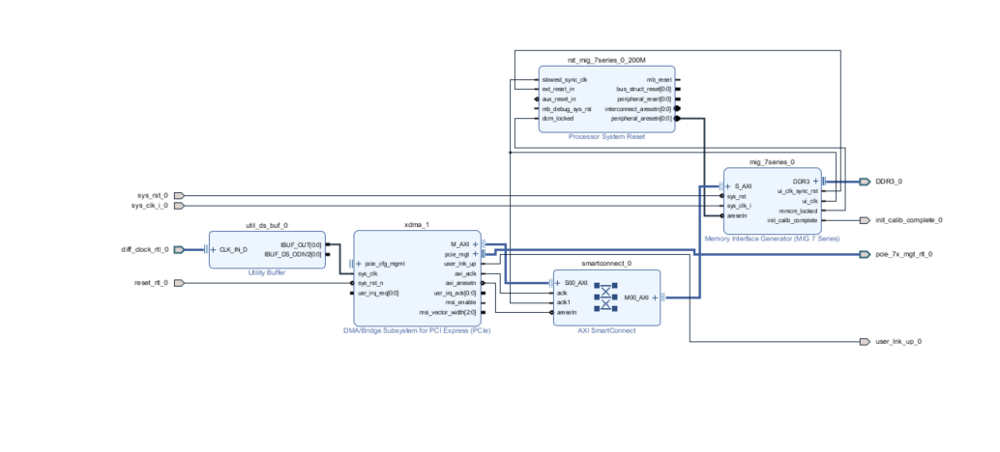
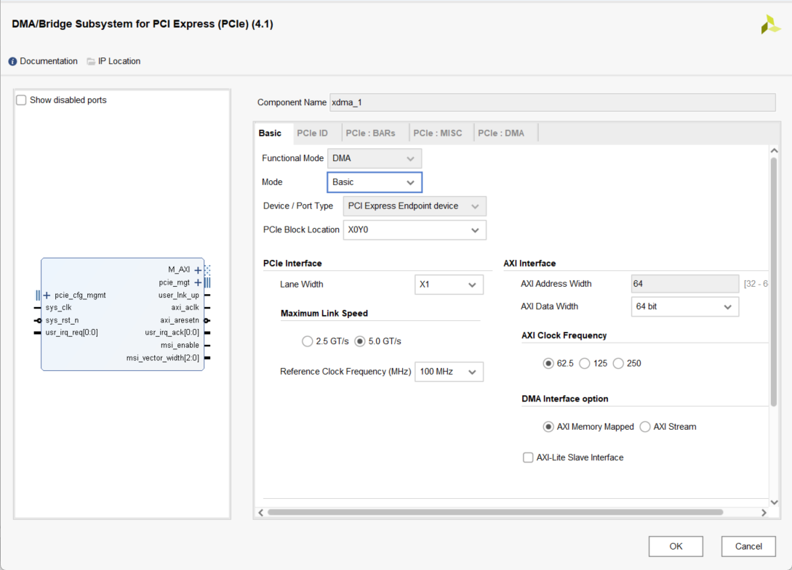
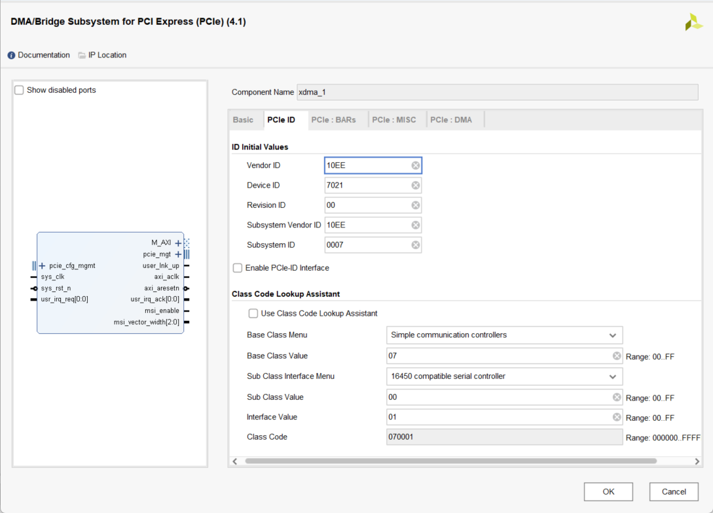

# 简介
本文档主要用于xlinx fpga 和rk3568 pcie 总线通信，在arm端xdam驱动编译和移植。
# 准备工作
## 1.确保fpga端的pcie总线配置无误，且已经正常烧写运行在fpga中。fpga端配置参考







## 2.在github上下载xdam驱动源码。拷贝到ubuntu主机上
## 3.编译之前确保主机的交叉编译工具已经存在和交叉环境已经ok
# 编译
进入目录/home/liudl/Project/dma_ip_drivers/XDMA/linux-kernel/xdma/
根据自身环境配置情况对xmda驱动进行编译，笔者是写了一个编译脚本对工程进行编译配置其脚本run.sh内容如下：
```
#!/bin/bash

# 简单版本的XDMA交叉编译脚本
export ARCH=arm64
export CROSS_COMPILE=aarch64-linux-
export KERNEL_DIR="/home/liudl/3568/OK3568_Linux_fs/kernel"

# 设置工具链路径
export PATH="/home/liudl/toolchain/bin:$PATH"

# 进入驱动目录
cd /home/liudl/Project/dma_ip_drivers/XDMA/linux-kernel/xdma

# 清理并编译
make clean
make -C "$KERNEL_DIR" M=$(pwd) modules

# 检查结果
if [ -f "xdma.ko" ]; then
    echo "编译成功！"
    file xdma.ko
else
    echo "编译失败"
fi
```
执行./run.sh编译
# 拷贝运行
将 编译完成的xdam.ko文件拷贝到arm设备上，增加其执行权限，使用insmod命令加载驱动
在 ls  /dev/xdam补齐查看xdma的节点，若存在xdma的节点则证明驱动加载成功。至此驱动加载完毕。

